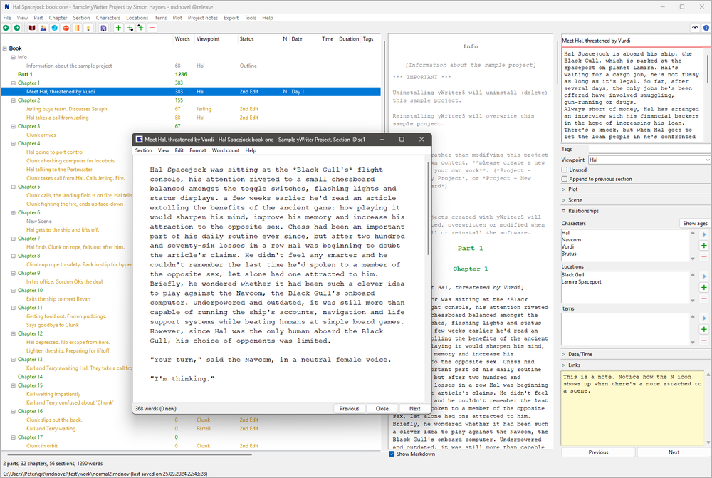

#  mdnovel

A novel writing application using markdown.

This is a variant of the [novelibre](https://github.com/peter88213/novelibre) novel writing application. 

## Note

This program is intended only as a proof of concept. It is still in Alpha status.

See the development details in the [mdnovel features project](https://github.com/users/peter88213/projects/17/views/2).

## Features (to come)

- With *mdnovel*, extensive novels can be broken down into **parts, chapters, and sections**. 
- You can store data on **characters, locations, and items** that are important for the story. 
  This includes the optional definition of a **viewpoint character** for each section. 
- All of this appears as a clear and editable **tree** structure with listed information. 
- Summaries can be entered at all these levels, from which **synopses** and lists can be generated. 
- If you choose a **narrative structure**, *mdnovel* can display stages (e.g. acts or steps) in the tree.
  When plotting, descriptions of these stages can be entered, from which *mdnovel* can generate 
  its own documentation. Prefabricated structural models can also be imported from templates.
- *mdnovel* also allows you to create and document an underlying structure of **plot lines** 
  (e.g. subplots or character arcs) apart from the chapters and sections. This can then be linked 
  to the sections of the novel text.
- *mdnovel* provides a **plot grid** with plot line notes for each section. This allows you to 
  see the big picture and keep track of multiple subplots.   
- To keep track of progress, the **word count** and the **completion status** of the sections are displayed. 
- Individual chapters and sections can be flagged as "unused" to exclude them from document export.
- You can add information about the **narrative time** and duration to each section. If you enter a date, 
  the day of the week is displayed. You can also call up the age of characters that are assigned to
  a section. The date and time information can be synchronised with dedicated timeline software.
- For **printing**, *mdnovel* exports a neatly designed novel manuscript that can be converted with *pandoc*
  into several document and ebook formats. 
- *mdnovel* saves its data in a single, easy-to-understand Markdown/YAML-formatted text file.
- *mdnovel* is written in Python and should run on several **operating systems**, like Windows and Linux.
- The application is ready for internationalization with GNU gettext. German translations are provided. 

## The differences to *novelibre* 

- All section content in *mdnovel* is Markdown-formatted.
- *mdnovel* comes with a Markdown section editor. The user is not supposed to export the text for editing. 
- *mdnovel* saves the project in a YAML/Markdown based file format instead of the XML based *.novx* format.
- There is no connection with OpenOffice/LibreOffice. 
- Document export is in Markdown or csv format. 
- New project can be created from Markdown-formatted Work-in-progress or outline.

## Requirements

- Windows or Linux. Mac OS support is experimental.
- [Python](https://www.python.org/) version 3.6+. 
     - For current Windows versions, use version 3.9.10 or above.
     - For Vista and Windows 7, use version 3.7.2.
     - Linux users: Make sure you have the *python3-tk* package installed. 
       To see the tooltips, make sure that you have the *idle3* package installed.
- Users may want to install [pandoc](https://pandoc.org/) for processing the exported documents.

## Download and install

### Default: Executable Python zip archive

Download the latest release [mdnovel_v0.1.3.pyzw](https://github.com/peter88213/mdnovel/raw/main/dist/mdnovel_v0.1.3.pyzw)

- Launch *mdnovel_v0.1.3.pyzw* by double-clicking (Windows/Linux desktop),
- or execute `python mdnovel_v0.1.3.pyzw` (Windows), resp. `python3 mdnovel_v0.1.3.pyzw` (Linux) on the command line.

#### Important

Many web browsers recognize the download as an executable file and offer to open it immediately. 
This starts the installation.

However, depending on your security settings, your browser may 
initially  refuse  to download the executable file. 
In this case, your confirmation or an additional action is required. 
If this is not possible, you have the option of downloading 
the zip file. 

### Alternative: Zip file

The package is also available in zip format: [mdnovel_v0.1.3.zip](https://github.com/peter88213/mdnovel/raw/main/dist/mdnovel_v0.1.3.zip)

- Extract the *mdnovel_v0.1.3* folder from the downloaded zipfile "mdnovel_v0.1.3.zip".
- Move into this new folder and launch *setup.pyw* by double-clicking (Windows/Linux desktop), 
- or execute `python setup.pyw` (Windows), resp. `python3 setup.pyw` (Linux) on the command line.

---

[Changelog](docs/changelog.md)

## Usage

See the [help pages](https://peter88213.github.io/mdnovel/help/)

---

## Credits

- The logo is made using the free *Pusab* font by Ryoichi Tsunekawa, [Flat-it](http://flat-it.com/).

## License

This is Open Source software, and *mdnovel* is licensed under GPLv3. See the
[GNU General Public License website](https://www.gnu.org/licenses/gpl-3.0.en.html) for more
details, or consult the [LICENSE](https://github.com/peter88213/novelibre/blob/main/LICENSE) file.

