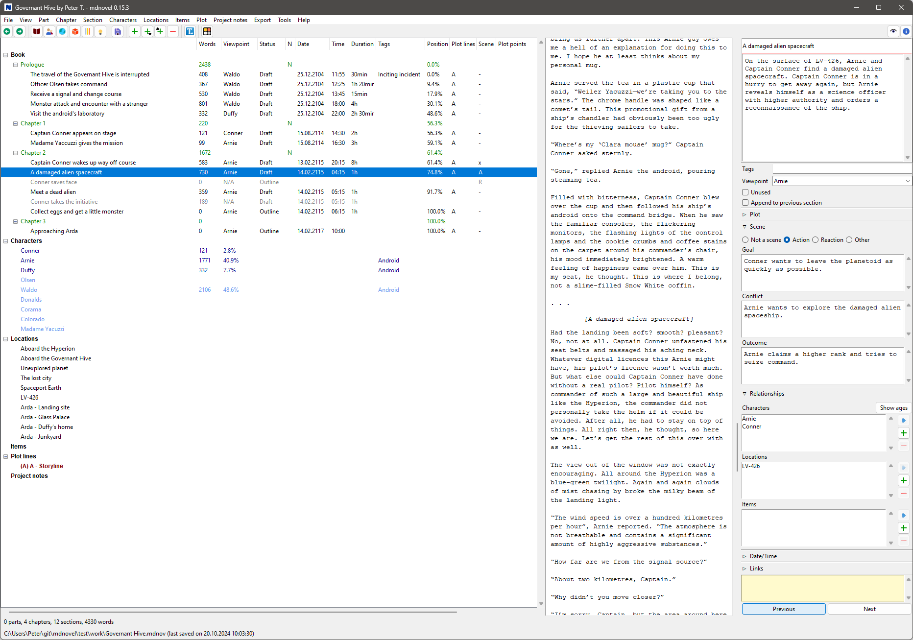
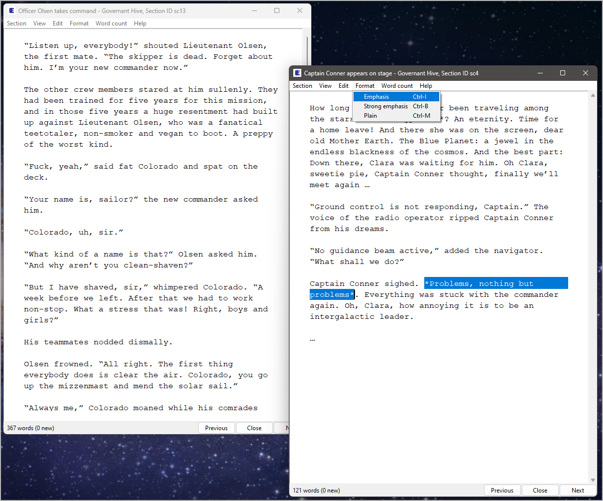
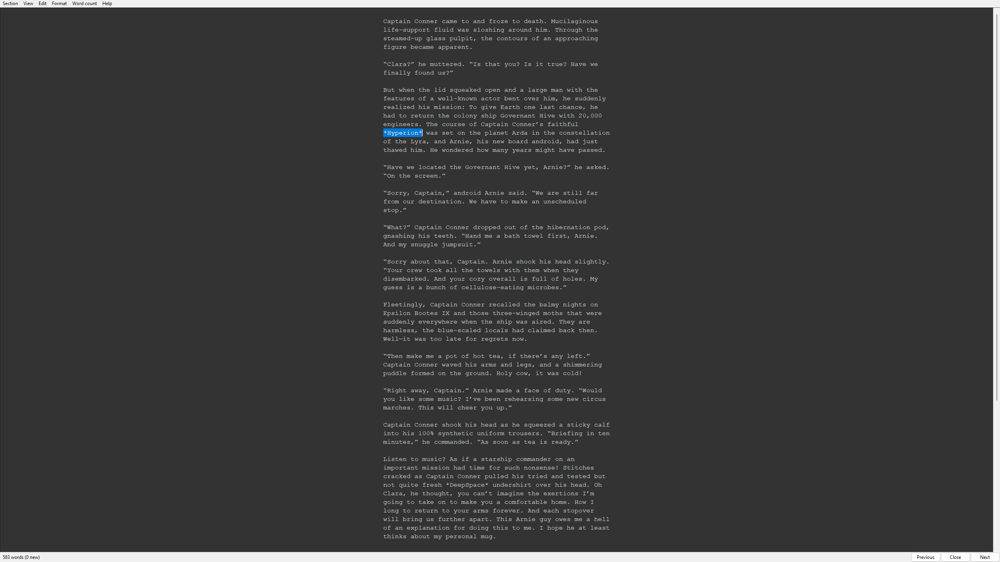
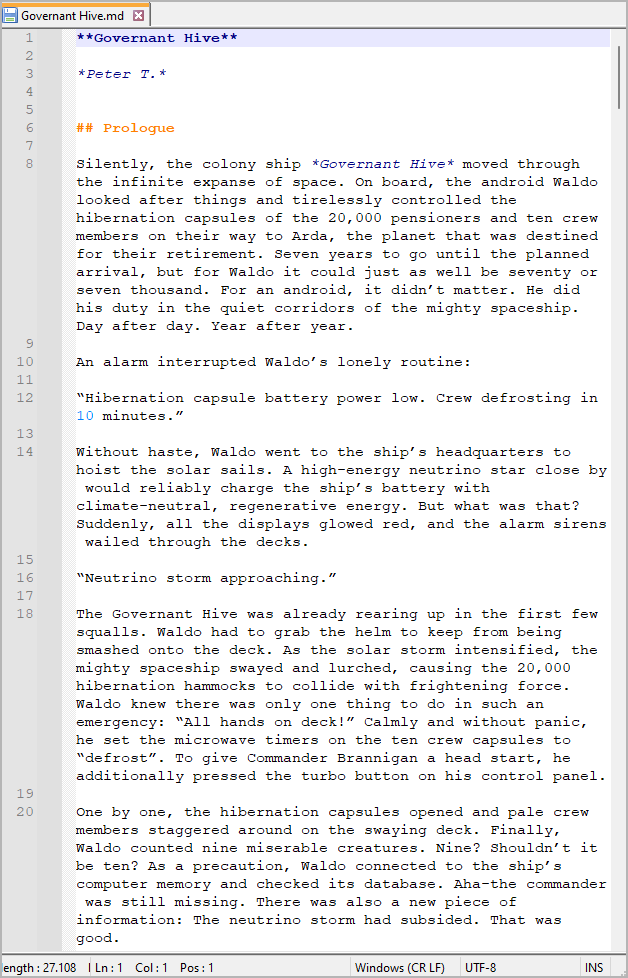
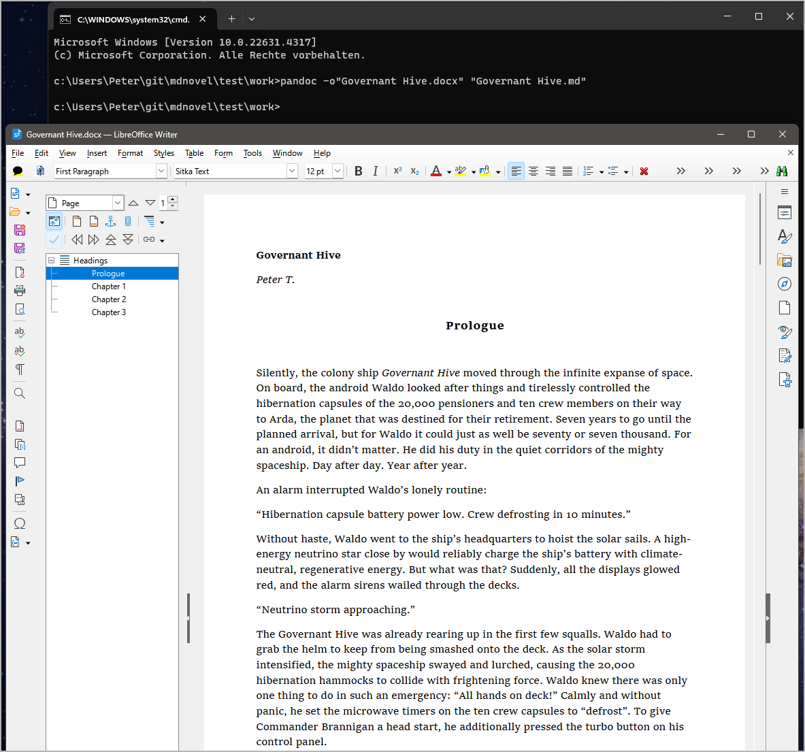
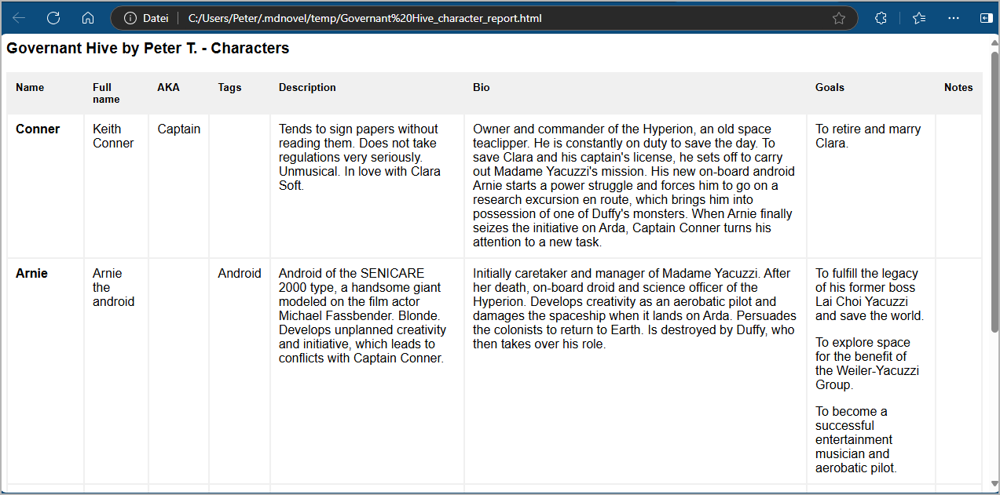
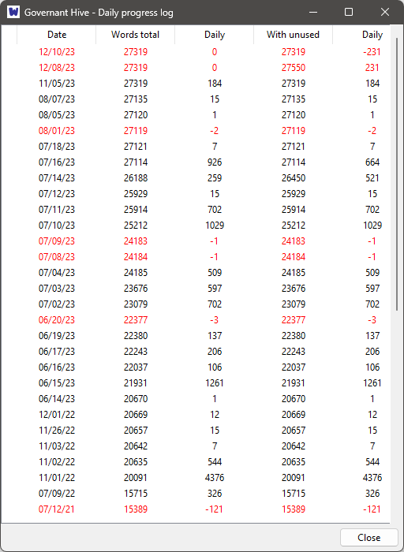
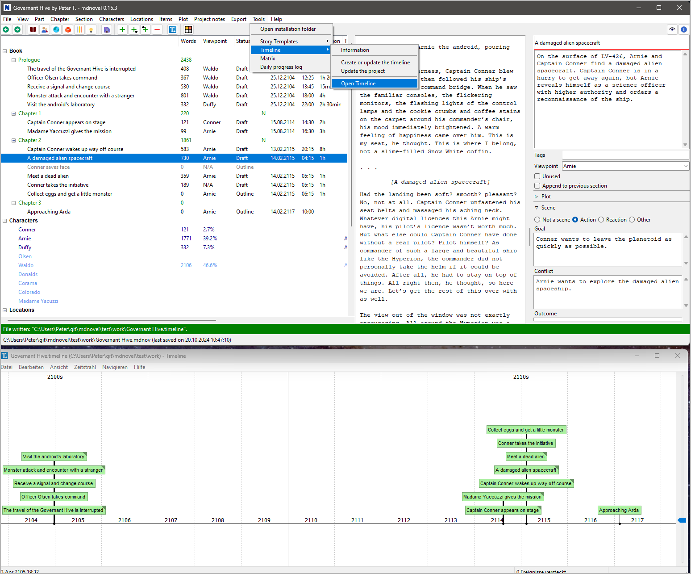
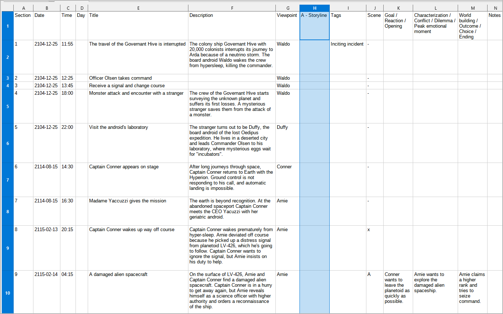
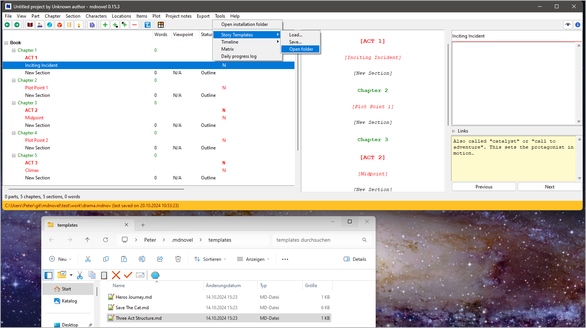

# mdnovel screenshots

---

The *mdnovel* desktop.

---

The multiple-sections editor.

---

Distraction-free editing mode.

---

Exported manuscript as Markdown file.

---

Manuscript converted with *Pandoc* to docx format.

---

Character list viewed with the system web browser.

---

Relationship matrix.

---

Daily progress log.

---

Timeline viewed with the free *Timeline* application.

---

Plot grid opened with a spreadsheet application.

---

Creating a new project using a template.

